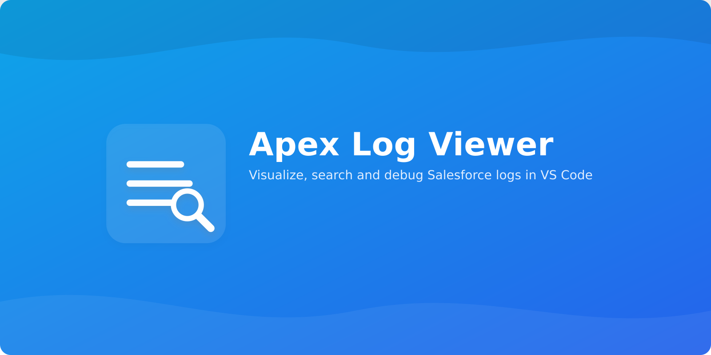
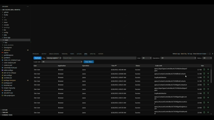

# Apex Log Viewer

Fast, searchable Salesforce Apex logs — right inside VS Code. Browse, filter, open, tail, and debug logs from your default or selected org with a smooth webview UI and Apex Replay integration.

[Install from Marketplace](https://marketplace.visualstudio.com/items?itemName=electivus.apex-log-viewer) · [Changelog](CHANGELOG.md) · [Report an issue](https://github.com/Electivus/Apex-Log-Viewer/issues)

## Features

- Webview log list: Paginated table with User, App, Operation, Time, Status, Code Unit, Size.
- Quick search + filters: Client‑side search plus filters by User, Operation, Status, Code Unit.
- Sort and scroll: Sort by any column; infinite scroll loads more logs automatically.
- Open or Replay: Open logs in the editor or launch Apex Replay with one click.
- Tail logs: Start real‑time tailing via Salesforce CLI from the toolbar.
- Org selection: Switch between authenticated orgs or use the CLI default.
- Configurable: `sfLogs.pageSize`, `sfLogs.headConcurrency`, and more.
- Localized: English and Brazilian Portuguese (pt‑BR).

Why developers like it

- Minimal clicks to find the right log.
- Fast, responsive UI that scales to large orgs.
- Works with both `sf` and legacy `sfdx` CLIs.

## Screenshots

## Requirements

- Salesforce CLI: Install either `sf` (recommended) or legacy `sfdx` and authenticate to an org.
  - Login example: `sf org login web` (or `sfdx force:auth:web:login`).
- VS Code 1.90+.
- Required for Replay: Salesforce Extension Pack (salesforce.salesforcedx-vscode), which includes Apex Replay Debugger.
  - A extensão não depende nem instala o pack automaticamente; se você tentar usar Replay sem o pack, abriremos a aba de Extensões apontando para o pacote para você instalar manualmente.

## Install

- From VS Code: open Extensions (Ctrl/Cmd+Shift+X), search for “Apex Log Viewer”, and click Install.
- Or use the Marketplace page: Install from Marketplace.

## Usage

- Open the Apex Logs panel: View > Appearance > Panel, then switch to the “Apex” container and the “Apex Logs” view.
- Refresh logs: Click “Refresh” in the toolbar or run the `Apex Logs: Refresh Logs` command.
- Select org: Use the toolbar dropdown or run `Apex Logs: Select Org`. Choose an authenticated org or “Default Org”.
- Search: Type in the search box to filter visible rows; combine with filters.
- Filters: Filter by User, Operation, Status, and Code Unit; clear quickly with “Clear filters”.
- Sorting: Click a header to sort (toggle asc/desc).
- Infinite scroll: Scroll to the bottom to load the next page.
- Open or Replay: Double‑click a row to open the log; click the action button to launch Apex Replay Debugger.

## Commands

- Apex Logs: Refresh Logs (`sfLogs.refresh`)
- Apex Logs: Select Org (`sfLogs.selectOrg`)
- Apex Logs: Tail Logs (`sfLogs.tail`)
- Apex Logs: Show Extension Output (`sfLogs.showOutput`)

## Settings

- `sfLogs.pageSize`: Number of logs fetched per page (10–200; default 100).
- `sfLogs.headConcurrency`: Max concurrent requests to fetch log headers (1–20; default 5).

API version is automatically taken from your workspace `sfdx-project.json` (`sourceApiVersion`).

 

## Localization

The extension uses `vscode-nls` for extension strings and a lightweight runtime for webview strings. English (en) and Brazilian Portuguese (pt-BR) are included.

## Troubleshooting

- “CLI not found”: Ensure `sf` (or `sfdx`) is installed and available on PATH. On macOS/Linux, ensure your login shell PATH includes the CLI (e.g., launch VS Code from the shell or configure the shell integration).
- “Failed to launch Apex Replay Debugger”: Install the Salesforce Apex Replay Debugger extension.
- “No orgs detected”: Ensure you’re authenticated (`sf org login web`) and try `sf org list`.

## For Contributors

- Development: run `npm run build`, `npm test`. See AGENTS.md and repo guidelines.
- Development setup: clone, `npm install`, `npm run build`, press `F5` to launch the Extension Development Host.
- CI details: see docs/CI.md.
- Testing (scratch orgs): see docs/TESTING.md.
- Publishing: see docs/PUBLISHING.md.

### Publishing (maintainers)

- Setup once: create a VS Code Marketplace publisher + PAT, add repo secret `VSCE_PAT`.
- Stable vs pre‑release: even minor = stable (e.g., 0.2.x); odd minor = pre‑release (0.3.x).
- CI path:
  - Bump `package.json` to the desired version.
  - Tag and push: `git tag vX.Y.Z && git push origin vX.Y.Z`.
  - CI builds; with `VSCE_PAT` present, it publishes to the right channel.
- Local path:
  - Stable: `npm run vsce:package` then `npm run vsce:publish`.
  - Pre‑release: `npm run vsce:package:pre` then `npm run vsce:publish:pre`.
- Assets & screenshots: see docs/ASSETS.md.

## Privacy & Security

- No tokens are logged by default. When `sfLogs.trace` is enabled, verbose output is sent to the “Apex Log Viewer” output channel; review logs before sharing.
- The extension shells out to `sf`/`sfdx` for org access and reads logs locally; it does not transmit your code or logs to third‑party services.

## License

MIT © Electivus
